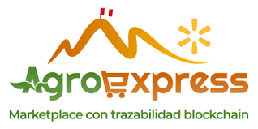
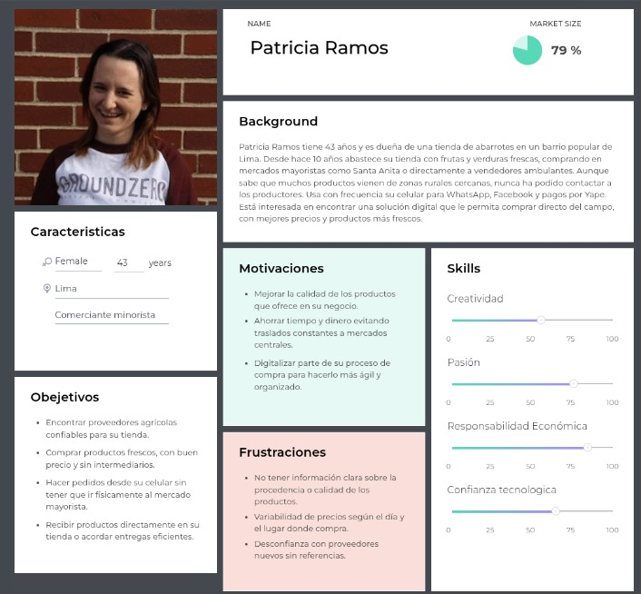
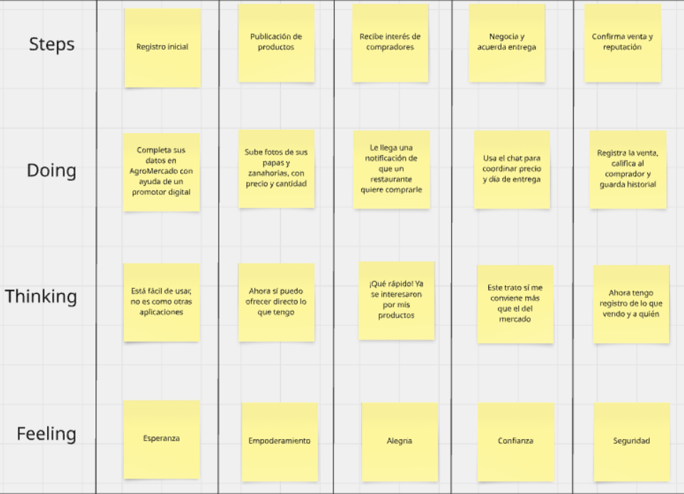

<h3 align="center"> Informe del trabajo final </h3>
<h3 align="center"> Universidad Peruana de Ciencias Aplicadas </h3>

 

  

 

<h3 align="center"> Ingeniería de Software </h3>
<h3 align="center"> Desarrollo de Aplicaciones Open Source - 2510 </h3>
<h3 align="center"> Docente: Rafael Oswaldo Castro Veramendi </h3>
<h3 align="center"> Empresa emergente: XXX </h3>
<h3 align="center"> Ingeniería de Software </h3>
<h3 align="center">  Miembros del equipo:</h3>

| Member                              |    Code    |
| :---------------------------------- | :--------: |
| Fabio Horna Silva                   | U202020229 |
| Anyelo Bill Alejos Jesus            | u20231d149 |

<h3 align="center">  Ciclo 2025-01 </h3>
<h3 align="center">  Registro de versiones del informe </h3>

  

## Registro de Versiones del Informe

<table>
  <thead>
    <tr>
      <th>Versión</th>
      <th>Fecha</th>
      <th>Autor</th>
      <th>Descripción de modificación</th>
    </tr>
  </thead>
  <tbody>
    <tr>
      <td>1.0</td>
      <td>25/04/2025</td>
      <td>Fabio Horna SIlva</td>
      <td>TB01</td>
    </tr>
    <tr>
      <td>1.0</td>
      <td>25/04/2025</td>
      <td>Anyelo Bill Alejos</td>
      <td>TB01</td>
    </tr>
    
  </tbody>
</table>

  

## Perspectivas de colaboración en informes de proyectos  

**URL del repositorio para el informe del proyecto:**  
TB1  

**Para el desarrollo del informe perteneciente a la entrega TB1, se dividió la implementación de secciones de la siguiente forma para cada integrante del equipo:**

| Integrante      | Tareas asignadas |
|-----------------|------------------|
| **Fabio Horna** | Durante el desarrollo de AgroMercado, realicé el análisis del problema de intermediación agrícola y definí los perfiles de usuario. Diseñé personas, empathy maps y estructuré entrevistas de validación para entender necesidades reales. Modelé el dominio aplicando DDD, diseñé los diagramas C4, la base de datos y las clases de dominio. Además, creé la landing page y el prototipo completo en Figma, incluyendo flujos de registro, publicación, compra y venta. Elaboré los diagramas de casos de uso, flujos de usuario y un Impact Map para conectar funcionalidades con objetivos de negocio. Validé cada avance asegurando que la solución fuera accesible, funcional y adaptada al contexto rural. |
| **Anyelo Alejos** | En base a nuestro proyecto realicé la Elicitación y Análisis de Requisitos del problema, como también la Especificación de Requisitos. Dentro de eso, analicé el mercado competitivo y las estrategias frente a los competidores. Así mismo, mediante entrevistas, diseño, registro y análisis, se detectaron las necesidades del usuario mediante User Personas, User Task Matrix, User Journey Mapping, Empathy Mapping y el As-Is Scenario Mapping. También elaboré el To-Be Scenario Mapping, verificando que el trabajo sea funcional y adaptado al contexto rural. |

---

|**Criterio específico**|**Acciones realizadas**|**Conclusiones**|
| - | - | - |
|Comunica en forma escrita ideas y/o resultados con objetividad a público de diferentes especialidades y niveles jerarquicos, en el marco del desarrollo de un proyecto en ingeniería.|
**Fabio Horna TB01:**

Documenté todas las etapas del proyecto AgroMercado de forma clara y precisa, incluyendo análisis de usuarios, modelado de dominio, arquitectura de software, base de datos, diseño de interfaces y validaciones. Ajusté el nivel de detalle de los informes según el público objetivo, elaborando desde reportes técnicos hasta resúmenes ejecutivos accesibles para usuarios no especializados.
|Logré transmitir los resultados del proyecto con objetividad, adaptando el lenguaje y el nivel de tecnicismo de los documentos para que fueran comprensibles y útiles tanto para especialistas en ingeniería como para usuarios de perfil operativo o estratégico.|
|Comunica oralmente sus ideas y/o resultados con objetividad al público de diferentes especialidades y niveles jerárquicos, en el marco del desarrollo de un proyecto en ingeniería.|
**Fabio Horna TB01:**

Expuse los avances y resultados de AgroMercado ante distintos públicos, utilizando presentaciones orales organizadas, lenguaje claro y ejemplos prácticos. Ajusté la profundidad de la explicación según el perfil de la audiencia (técnicos, gestores, usuarios finales), asegurando la comprensión del flujo de la plataforma, el impacto esperado y los beneficios para los usuarios rurales.
|Pude comunicar ideas y resultados de forma comprensible y objetiva, logrando que tanto especialistas técnicos como usuarios de distintas áreas entendieran el propósito, el diseño y el funcionamiento de la solución desarrollada.|
|Comunica oralmente sus ideas y/o resultados con objetividad al público de diferentes especialidades y niveles jerárquicos, en el marco del desarrollo de un proyecto en ingeniería.|
**Anyelo Bill Alejos Jesus TB01:**

Realicé exposiciones internas sobre los avances en la identificación de necesidades de los usuarios, el diseño de entrevistas y la elaboración de perfiles de usuarios. Expliqué con claridad cómo cada apartado contribuye a la solución de problemas reales del mercado agrícola peruano. Ajusté el nivel de tecnicismo y ejemplos utilizados según el público, utilizando lenguaje sencillo para referirme a funcionalidades complejas como trazabilidad de productos, reputación de usuarios o filtros de búsqueda agrícola.
|Logré comunicar los objetivos y beneficios de AgroMercado de forma sencilla y efectiva, ayudando a que tanto mi equipo como otros perfiles comprendan cómo nuestra solución mejora la comercialización agrícola.|
|Comunica en forma escrita ideas y/o resultados con objetividad a público de diferentes especialidades y niveles jerárquicos, en el marco del desarrollo de un proyecto en ingeniería.|
**Anyelo Bill Alejos Jesus TB01:**

Participé activamente en el desarrollo de los apartados de Elicitación y Análisis de Requisitos, incluyendo el análisis competitivo de plataformas agrícolas en el mercado peruano, el diseño de entrevistas para productores y compradores, la creación de User Personas representativos del público objetivo, la matriz de tareas (User Task Matrix) y el planteamiento de estrategias y tácticas basadas en el análisis SWOT.
|
Pude organizar y comunicar la información del proyecto de manera comprensible y concreta, permitiendo que cualquier lector entienda el valor y propósito de AgroMercado.

|

## Contenido

### 1. Capítulo I: Introducción  
#### 1.1. Perfil de la startup  
- 1.1.1. Descripción de la startup  
- 1.1.2. Perfiles de los integrantes del equipo  

#### 1.2. Perfil de la solución  
- 1.2.1. Antecedentes y problemática  
- 1.2.2. Proceso Lean UX  
  - 1.2.2.1. Lean UX Problem Statements  
  - 1.2.2.2. Lean UX Assumptions  
  - 1.2.2.3. Lean UX Hypothesis Statements  
  - 1.2.2.4. Lean UX Canvas  

#### 1.3. Segmentos objetivo  

### 2. Capítulo II: Elicitación y Análisis de Requisitos  
#### 2.1. Competidores  
- 2.1.1. Análisis competitivo  
- 2.1.2. Estrategias y tácticas frente a competidores  

#### 2.2. Entrevistas  
- 2.2.1. Diseño de entrevistas  
- 2.2.2. Registro de entrevistas  
- 2.2.3. Análisis de entrevistas  

#### 2.3. Detección de necesidades (Needfinding)  
- 2.3.1. User Personas  
- 2.3.2. User Task Matrix  
- 2.3.3. User Journey Mapping  
- 2.3.4. Empathy Mapping  
- 2.3.5. As-Is Scenario Mapping  

#### 2.4. Lenguaje ubicuo (Ubiquitous Language)  

### 3. Capítulo III: Especificación de Requisitos  
- 3.1. To-Be Scenario Mapping  
- 3.2. User Stories  
- 3.3. Impact Mapping  
- 3.4. Product Backlog  

### 4. Capítulo IV: Diseño del Producto  
#### 4.1. Guías de estilo  
- 4.1.1. Generales  
- 4.1.2. Web  

#### 4.2. Arquitectura de la información  
- 4.2.1. Sistemas de organización  
- 4.2.2. Sistemas de etiquetado  
- 4.2.3. Etiquetas SEO y Meta Tags  
- 4.2.4. Sistemas de búsqueda  
- 4.2.5. Sistemas de navegación  

#### 4.3. Diseño de la interfaz de la Landing Page  
- 4.3.1. Wireframe  
- 4.3.2. Mock-up  

#### 4.4. Diseño UX/UI de Aplicaciones Web  
- 4.4.1. Wireframes  
- 4.4.2. Diagramas de flujo  
- 4.4.3. Mock-ups  
- 4.4.4. Diagramas de flujo de usuario  

#### 4.5. Prototipado de aplicaciones web  

#### 4.6. Arquitectura de software orientada al dominio  
- 4.6.1. Diagrama de contexto  
- 4.6.2. Diagramas de contenedores  
- 4.6.3. Diagramas de componentes  

#### 4.7. Diseño orientado a objetos de software  
- 4.7.1. Diagramas de clases  
- 4.7.2. Diccionario de clases  

#### 4.8. Diseño de base de datos  
- 4.8.1. Diagrama de base de datos  

### 5. Capítulo V: Implementación, Validación y Despliegue del Producto  
#### 5.1. Gestión de configuración del software  
- 5.1.1. Entorno de desarrollo  
- 5.1.2. Gestión del código fuente  
- 5.1.3. Guía de estilo y convenciones  
- 5.1.4. Configuración del despliegue  

#### 5.2. Implementación de la landing page, servicios y aplicaciones  
- 5.2.1. Sprint n  
  - 5.2.1.1. Planificación  
  - 5.2.1.2. Líderes y colaboradores  
  - 5.2.1.3. Sprint Backlog  
  - 5.2.1.4. Evidencia de desarrollo  
  - 5.2.1.5. Evidencia de ejecución  
  - 5.2.1.6. Documentación de servicios  
  - 5.2.1.7. Despliegue del software  
  - 5.2.1.8. Colaboración del equipo  

#### 5.3. Entrevistas de validación  
- 5.3.1. Diseño  
- 5.3.2. Registro  
- 5.3.3. Evaluaciones heurísticas  

#### 5.4. Video acerca del producto

# Capítulo I: Introducción
### 1.1 Perfil de inicio.

En esta sección se presenta la descripción del startup y los perfiles de los miembros del equipo.

### 1.1.1. Descripción del inicio.

Neuronet es una startup tecnológica que busca impulsar la transformación digital en el sector agroalimentario peruano mediante el desarrollo de soluciones tecnológicas accesibles, escalables e inclusivas. Su enfoque se centra en generar impacto social y económico conectando directamente a pequeños y medianos agricultores con compradores mayoristas, minoristas y establecimientos comerciales que requieren productos frescos y confiables.

La empresa apuesta por reducir la cadena de intermediarios que históricamente ha afectado la rentabilidad del productor rural, mientras mejora la trazabilidad, calidad y eficiencia en la cadena de abastecimiento de alimentos. Neuronet opera bajo un modelo centrado en el usuario y emplea metodologías ágiles y de diseño UX para crear herramientas tecnológicas adaptadas a las realidades del campo peruano.

Entre sus principios rectores destacan la sostenibilidad, la equidad en las relaciones comerciales y el uso estratégico de datos para optimizar la oferta y demanda en el ecosistema agroalimentario.

**Misión:** Desarrollar soluciones tecnológicas prácticas y accesibles que conecten directamente a los agricultores peruanos con compradores mayoristas y minoristas, facilitando el comercio justo, reduciendo intermediarios y fortaleciendo la economía rural mediante una plataforma digital confiable, sencilla y adaptada a la realidad del agro nacional.

**Visión:** Convertirnos en la plataforma digital de referencia en el Perú para la comercialización directa de productos agrícolas, impulsando la inclusión tecnológica del pequeño y mediano productor, y promoviendo una red de abastecimiento transparente, eficiente y sostenible que beneficie tanto al campo como al consumidor urbano.

**Logotipo de la Startup:**

**Logotipo del servicio**

### 1.1.2. Perfiles de integrantes del equipo

<table>
  <tr align="center">
    <td rowspan="4">
      
    </td>
    <td align="left">
      <b>Nombre y Apellido:</b>
                   
      Fabio Horna Silva
    </td>
  </tr>
  <tr>
    <td align="left">
    <b>Código:</b>
     
    U202020229
    </td>
  </tr>
  <tr>
    <td align="left">
    <b>Carrera:</b>
     
    Ingeniería de Software
    </td>
  </tr>
  <tr>
    <td align="left">
    <b>Acerca de:</b>
     
     Mi nombre es Fabio Horna Silva, , tengo 21 años y soy estudiante de la carrera de Ingeniería de Software en la UPC. Tengo experiencia programando en Python y conocimientos en gestión de proyectos bajo metodologías ágiles, así como en ciberseguridad y auditoría de TI. Me considero una persona comprometida, curiosa y con buena disposición para aportar al desarrollo de cualquier proyecto de forma responsable y colaborativa.
    </td>
  </tr>
  </tr>

  <tr align="center">
    <td rowspan="4">
      
    </td>
    <td align="left">
      <b>Nombre y Apellido:</b>
                   
      Anyelo Bill Alejos Jesus
    </td>
  </tr>
  <tr>
    <td align="left">
    <b>Código:</b>
     
    U20231d149
    </td>
  </tr>
  <tr>
    <td align="left">
    <b>Carrera:</b>
     
    Ingeniería de Software
    </td>
  </tr>
  <tr>
    <td align="left">
    <b>Acerca de:</b>
     
    Mi nombre es Anyelo Alejos, tengo 20 años, soy estudiante de la carrera de ingeniería de software actualmente estoy cursando en el 5to ciclo de la carrera, tengo conocimientos en c++, python y me considero una persona responsable y proactiva para dar lo mejor de mi en el proyecto que se realizará.
    </td>
  </tr>
  </tr>

</table>

## 1.2. Perfil de la solución.

### 1.2.1. Antecedentes y Problemática.

**¿Qué?**

**¿Cuál es el problema?**

El problema radica en la falta de una herramienta digital que facilite la conexión directa entre los productores agrícolas peruanos y los compradores mayoristas o minoristas que requieren productos frescos del campo. Esta desconexión genera ineficiencia, pérdida de ingresos para los agricultores, y dificultad para garantizar la trazabilidad de los productos. A nivel nacional, se estima que el 60% de las unidades agropecuarias comercializa sus productos a través de intermediarios informales, lo que limita el acceso a mercados más rentables y estructurados (INEI, 2022). Además, las plataformas digitales existentes se enfocan en grandes cadenas de suministro o exportación, sin considerar la realidad tecnológica y operativa de los pequeños productores rurales (The Yield Lab, 2023).

**¿Cuándo?**

**¿Cuándo sucede el problema?**

El problema se presenta constantemente cuando un agricultor busca comercializar su producción, debiendo recurrir a mercados informales, ferias o intermediarios. Lo mismo ocurre cuando un comprador del sector minorista o institucional intenta abastecerse directamente desde el campo, sin acceso confiable a la oferta real disponible.

**¿Dónde?**

**¿Dónde se dirige el servicio?**

La solución está dirigida al mercado agrícola peruano, con enfoque inicial en regiones como Lima, La Libertad y Junín, donde existe una alta concentración de agricultores pequeños y una creciente demanda urbana de productos frescos.

**¿Dónde surge el problema?**

El problema surge en las zonas rurales productoras, donde los agricultores carecen de canales digitales para ofrecer sus productos directamente a los compradores. Asimismo, en los centros urbanos, los compradores enfrentan dificultades para acceder a proveedores confiables y productos de calidad a precios competitivos.

**¿Quién?**

**¿Quiénes están involucrados? ¿Quién lo utilizará?**

Los principales usuarios del sistema serán:

- **Productores agrícolas**: pequeños y medianos agricultores que necesitan un canal directo y transparente para colocar sus productos.
- **Compradores**: restaurantes, mercados minoristas, hoteles, distribuidores y otros actores que requieren abastecimiento periódico o puntual de productos agrícolas.
- **Administradores de la plataforma**: encargados de monitorear el uso, validar registros y brindar soporte a los usuarios.

**¿Por qué?**

**¿Cuál es la causa del problema?**

La causa principal es la ausencia de un ecosistema digital inclusivo que articule eficientemente a los distintos actores de la cadena agroalimentaria, especialmente a los pequeños productores que no cuentan con herramientas para ofrecer sus productos de manera estructurada y profesional. Según el Ministerio de Desarrollo Agrario y Riego, más del 70% de agricultores carecen de acceso a plataformas digitales de comercialización o no cuentan con el conocimiento necesario para utilizarlas (MIDAGRI, 2023). Esta brecha tecnológica se ve agravada por la informalidad del sector y la falta de confianza entre productores y compradores, lo que impide acuerdos directos y sostenibles a largo plazo.

**¿Cómo?**

**¿Cómo se utilizará el producto?**

AgroMercado será una plataforma web accesible desde cualquier navegador. Los productores podrán registrar sus productos, cantidades, fechas de disponibilidad, precios y ubicación. Los compradores, a su vez, podrán buscar ofertas por región, tipo de producto o disponibilidad, contactarse con los productores, generar órdenes de compra y hacer seguimiento a sus pedidos.

**¿Cómo lograremos una gestión comercial eficiente en la plataforma?**

La plataforma estructurará la información agrícola por lotes, zonas y categorías. Se habilitarán filtros dinámicos, módulos de mensajería directa, historial de pedidos, reputación de usuarios y reportes analíticos para optimizar decisiones de compra y venta. Todo ello sobre una base de datos segura y con diseño UX centrado en usuarios con bajo nivel de alfabetización digital.

**¿Cuánto?**

**¿Cuál es la magnitud del problema?**

Según la Encuesta Nacional Agropecuaria 2022, el 88% de las unidades agropecuarias en el Perú corresponden a agricultura familiar de subsistencia, lo que evidencia la necesidad de herramientas que mejoren su acceso al mercado (INEI, 2022). Además, en 2022, las ventas de restaurantes en el país registraron un incremento de 51.9% en relación al periodo 2021, lo que indica una creciente demanda de productos agrícolas frescos (Ministerio de la Producción, 2024). Esta situación resalta la importancia de una plataforma como AgroMercado para conectar eficientemente la oferta y la demanda en el sector agroalimentario peruano.

**¿Qué porcentaje del personal de la industria champiñonera se verá beneficiado por el servicio?**

El sistema puede ser utilizado por múltiples técnicos, supervisores y administradores que incorporan al personal de las fábricas champiñoneras. No hay un límite específico en cuanto al número de usuarios. Sin embargo, se establece una estimación de un 35% de usuarios beneficiarios dentro de este sector.

### 1.2.2. Proceso Lean UX.

### 1.2.2.1. Enunciados de problemas de Lean UX.

**Planteamiento del problema:**

El propósito de AgroMercado es ofrecer a los agricultores peruanos y a los compradores del sector retail y mayorista una plataforma digital que facilite la comercialización directa de productos agrícolas, eliminando intermediarios innecesarios y reduciendo costos. Esta herramienta busca proporcionar un canal eficiente, confiable y accesible para publicar, encontrar, negociar y adquirir productos agrícolas frescos desde cualquier lugar del país.

El problema se evidencia cuando los productores carecen de canales digitales para mostrar su oferta, y los compradores enfrentan barreras para acceder a proveedores confiables, precios justos o productos con trazabilidad garantizada. Actualmente, muchos procesos de compra-venta se realizan de forma informal, por redes sociales o contactos personales, lo que genera desorden, falta de transparencia y altos márgenes de pérdida o sobreprecio.

Hemos identificado que la desconexión entre el campo y el mercado urbano es una de las principales causas de ineficiencia y desigualdad económica en la cadena agroalimentaria. Esta situación reduce la rentabilidad del agricultor, incrementa el desperdicio de alimentos y limita el abastecimiento confiable en puntos de venta urbanos.

¿Cómo podríamos conectar de forma digital y estructurada a los productores agrícolas peruanos con compradores minoristas y mayoristas, asegurando trazabilidad, eficiencia y condiciones comerciales justas para ambos?

### 1.2.2.2. Supuestos de Lean UX.

**Supuestos comerciales:**

1\.  	**Creemos que los pequeños y medianos agricultores necesitan un canal directo** para comercializar sus productos agrícolas sin depender de intermediarios.

2\.  	**Estas necesidades pueden ser atendidas mediante una plataforma digital** que permita registrar la oferta agrícola por producto, ubicación, fecha y precio, con acceso desde teléfonos móviles y computadoras.

3\.  	**Nuestros usuarios iniciales serán agricultores con acceso básico a Internet**, así como compradores mayoristas y minoristas que actualmente utilizan canales informales como WhatsApp o Facebook.

4\.  	**El valor principal que obtendrán los usuarios es la posibilidad de publicar y encontrar productos agrícolas** con información verificada y contacto directo entre las partes.

5\.  	**El cliente también podrá visualizar métricas de ventas, histórico de pedidos, reputación del usuario**, y recibir alertas según productos, ubicación o estacionalidad.

6\.  	**La adquisición de usuarios se logrará mediante campañas digitales**, difusión en redes rurales, y alianzas con cooperativas, municipios o asociaciones de productores.

7\.  	**El modelo de negocio se basará en suscripciones escalables o comisiones por transacción**, adaptadas al volumen y tipo de usuario.

8\.  	**Nuestra competencia directa serán plataformas genéricas de comercio** (**como OLX o Marketplace), que no están diseñadas para el agro y no consideran trazabilidad ni reputación agrícola.**

9\.  	**Nuestra ventaja competitiva será ofrecer una plataforma hecha exclusivamente para el sector agrícola**, con segmentación por cultivo, ubicación y tipo de transacción.

10\. **El mayor riesgo es la desconfianza tecnológica o el bajo acceso a** conectividad en zonas rurales. Este será mitigado con interfaz amigable, módulos offline en desarrollo, y asistencia técnica local.

### 1.2.2.3. Supuestos del Usuario

**¿Quién es el usuario?**

usuarios principales de AgroMercado son, por un lado, los pequeños y medianos productores agrícolas que buscan canales más justos y directos para vender sus productos. Por otro lado, la plataforma está dirigida a compradores mayoristas y minoristas, tales como mercados, restaurantes, hoteles y distribuidores, interesados en obtener productos frescos de manera confiable. Si la plataforma tiene éxito en este segmento inicial, se proyecta su expansión hacia cooperativas, asociaciones de productores e incluso programas públicos de abastecimiento, adaptando la lógica de oferta-demanda a distintos modelos operativos del agro.

**¿Qué problemas tiene nuestro producto? ¿Qué resuelve?**

Uno de los retos actuales en la comercialización agrícola es la informalidad y desorganización en los canales de venta. Los agricultores deben gestionar pedidos, precios y entregas a través de llamadas o chats, sin trazabilidad ni registro estructurado. AgroMercado resuelve esto al permitir una publicación ordenada de productos, categorización por tipo, disponibilidad y ubicación, así como la gestión de pedidos, reputación y reportes. Otro desafío potencial está en la falta de conectividad o alfabetización digital en algunas regiones, lo cual se resolverá con un diseño accesible y capacitación inicial.

**¿Qué características son importantes?**

Las características más importantes de AgroMercado son: el registro y publicación de productos agrícolas por lote, tipo, cantidad y fecha de disponibilidad; visualización de oferta y demanda por zonas geográficas; módulos de pedidos, historial, alertas y mensajería directa; y reportes de ventas y métricas de desempeño. Todo esto apunta a reducir pérdidas, planificar mejor la producción y negociar en mejores condiciones.

**¿Dónde encaja nuestro producto en su trabajo o vida?**

AgroMercado encaja como una herramienta esencial dentro del proceso comercial del agricultor y del abastecimiento del comprador. Para el agricultor, se convierte en su vitrina digital; para el comprador, en su fuente confiable de proveedores. La plataforma entra en juego en momentos críticos como la planificación de cosecha, la negociación de precios o la toma de decisiones logísticas.

**¿Cuándo y cómo es nuestro producto usado?**

El servicio será utilizado cuando se presenten oportunidades de venta o búsqueda de productos agrícolas, ya sea por campañas de siembra, sobreoferta temporal o necesidad urgente de abastecimiento. Se utilizará en computadoras, tablets o smartphones, con interfaces adaptadas al nivel de experiencia tecnológica de los usuarios. Los usuarios podrán ingresar, filtrar y responder pedidos en tiempo real, sin necesidad de herramientas externas.

**¿Cómo debe verse nuestro producto y cómo debe comportarse?**

La aplicación debe ofrecer una interfaz amigable, simple, accesible y visualmente clara, especialmente para usuarios con poca experiencia digital. El comportamiento de la plataforma debe priorizar la velocidad, simplicidad en la navegación, privacidad de los datos y seguridad en la interacción comercial. Debe fomentar confianza y profesionalismo, con módulos de reputación, validación de identidad y trazabilidad de las transacciones.

### 1.2.2.4. Supuestos de Características

- **Creemos que la aplicación debe contar con una interfaz de usuario intuitiva y fácil de usar** que permita tanto a agricultores como a compradores operar sin necesidad de formación técnica avanzada.
- **Creemos que el sistema debe proporcionar notificaciones y alertas personalizables** que informen sobre nuevos pedidos, cambios en disponibilidad, mensajes recibidos o vencimientos de publicación.
- **Creemos que la aplicación debe permitir la integración futura con otros sistemas de gestión** como herramientas de logística, pasarelas de pago o plataformas de trazabilidad para exportación.
- **Creemos que la plataforma debe incluir herramientas visuales como reportes y gráficos** que permitan analizar desempeño de ventas, productos más demandados, zonas de mayor rotación y métricas históricas relevantes para la planificación comercial.

### 1.2.2.3. Declaraciones de hipótesis de Lean UX.

- **Enunciado de hipótesis 01:**
- **Creemos que** los agricultores y compradores del sector retail y mayorista estarán dispuestos a adoptar la plataforma AgroMercado para comercializar directamente productos agrícolas sin necesidad de intermediarios.

  **Sabremos que hemos tenido éxito**

  **cuando** al menos el 60% de los usuarios registrados completen una transacción dentro de los primeros tres meses de uso de la plataforma.
- **Creemos que** la funcionalidad de contacto directo y gestión de pedidos en la aplicación fomentará una mejor comunicación comercial entre productores y compradores.

  **Sabremos que hemos tenido éxito**

  **cuando** se registre un aumento del 40% en la frecuencia de interacciones (mensajes, cotizaciones o pedidos) entre ambas partes durante el segundo mes posterior al registro.
- **Creemos que** la disponibilidad de información organizada y filtrada por región, tipo de producto y disponibilidad permitirá a los compradores tomar decisiones de compra más rápidas y eficientes.

  **Sabremos que hemos tenido éxito**

  **cuando** al menos un 70% de los compradores afirmen haber encontrado la oferta adecuada en menos de 15 minutos dentro de la plataforma, según encuestas internas.
- **Creemos que** la trazabilidad de productos y la reputación de usuarios mejorará la confianza en el uso de la plataforma, disminuyendo la dependencia de intermediarios informales.

  **Sabremos que hemos tenido éxito**

  **cuando** se identifique una reducción del 50% en las transacciones externas paralelas (fuera de la plataforma) entre usuarios recurrentes, en comparación con las primeras semanas de uso.

## 1.3. Segmentos objetivo

En el Perú, la cadena agroalimentaria se caracteriza por una alta fragmentación en la producción y una comercialización dominada por intermediarios. De acuerdo con el Censo Nacional Agropecuario, más del 88% de las unidades agropecuarias corresponden a agricultura familiar, siendo este grupo el más afectado por la falta de canales digitales de venta directa (INEI, 2022). Esta situación limita las oportunidades comerciales de los agricultores y reduce su capacidad de negociación frente a mercados urbanos y mayoristas.

Por otro lado, se proyecta que la demanda global de alimentos aumentará en un 70% para 2050, lo cual exige transformar los sistemas de producción y comercialización con el apoyo de la tecnología (FAO, 2023). En este contexto, herramientas como plataformas digitales de intermediación agrícola representan una oportunidad concreta para acortar la cadena de suministro, mejorar la trazabilidad de los productos, reducir pérdidas postcosecha y mejorar el acceso a mercados más rentables (The Yield Lab, 2023).

En el Perú, esta brecha digital se evidencia también desde el lado de la demanda. Según el Ministerio de la Producción, más del 60% de los restaurantes y comercios minoristas reportan dificultades para abastecerse de productos agrícolas frescos de manera constante y a precios competitivos (Ministerio de la Producción, 2024). Esta situación genera un escenario ideal para el desarrollo de una solución como AgroMercado, que busca conectar directamente a productores agrícolas con compradores mayoristas y minoristas a través de una plataforma digital accesible, confiable y pensada para la realidad del agro peruano.

AgroMercado tiene como segmento objetivo primario a los pequeños y medianos agricultores con excedente de producción y acceso básico a herramientas digitales, así como a compradores del canal horeca (hoteles, restaurantes, catering), distribuidores minoristas y mercados municipales que deseen acceder a productos frescos con trazabilidad directa. En una segunda fase, se contempla su escalabilidad hacia cooperativas, asociaciones productoras, gobiernos locales y programas públicos de abastecimiento

<table><tr><th valign="top">Segmento Principal</th><th valign="top">Subsegmento</th><th valign="top">Descripción</th></tr>
<tr><td rowspan="3" valign="top">Productores</td><td valign="top">roductores agrícolas individuales</td><td valign="top">Pequeños y medianos agricultores con excedente de producción y acceso digital.</td></tr>
<tr><td valign="top">Asociaciones y cooperativas agrarias</td><td valign="top">Organizaciones que centralizan y comercializan la producción de sus miembros.</td></tr>
<tr><td valign="top">Gobiernos locales (como proveedores)</td><td valign="top">Municipalidades rurales con producción agrícola institucionalizada.</td></tr>
<tr><td rowspan="3" valign="top">Compradores</td><td valign="top">Compradores mayoristas</td><td valign="top">Mercados de abasto, acopiadores y distribuidores regionales.</td></tr>
<tr><td valign="top">Compradores minoristas (retail)</td><td valign="top">Restaurantes, hoteles, cafeterías, supermercados independientes.</td></tr>
<tr><td valign="top">Gobiernos locales (como compradores)</td><td valign="top">Compradores institucionales para comedores populares o programas sociales.</td></tr>
</table>

# 2. Capítulo II: Elicitación y Análisis de Requisitos

## 2.1. Competidores

Previo al desarrollo de la aplicación, hicimos una búsqueda de las opciones que ya existen en el mercado, para ver qué es lo que ofrecen y cómo podemos diferenciarnos de ellos.

- Hortus 

Hortus es una plataforma digital enfocada en la comercialización de productos agroecológicos directamente desde el campo. Su modelo está centrado en el consumo responsable y la sostenibilidad ambiental, permitiendo a consumidores urbanos acceder a alimentos orgánicos de origen certificado. La fortaleza de Hortus radica en su enfoque ecológico y en la fidelización de un público con intereses muy específicos. Sin embargo, su impacto suele limitarse a nichos urbanos, y su escalabilidad hacia zonas rurales es más reducida.

- AgroPlaza

Agroplaza funciona como un marketplace agropecuario que conecta tanto a productores como a empresas del sector agrícola. Ofrece desde productos alimenticios hasta insumos y equipos. Es una plataforma más generalista, orientada al comercio a gran escala y a distribuidores. Aunque su cobertura de productos es amplia, su estructura no está pensada para facilitar el acceso de agricultores de pequeña escala, lo cual representa una diferencia clave respecto a AgroMercado, que prioriza la inclusión de productores familiares y rurales.

- AgroExpress

AgroExpress combina tecnología con logística, ofreciendo una solución que conecta a productores del campo con restaurantes y comercios urbanos mediante entregas programadas. Su valor diferencial está en la rapidez de distribución y la eficiencia del servicio. No obstante, su foco está puesto en el comprador y en resolver la parte logística de la cadena de abastecimiento, mientras que AgroMercado pone al agricultor como eje central del sistema y busca resolver no solo la logística, sino también la trazabilidad, la negociación directa y la formalización del comercio agrícola.

<table><tr><th colspan="6" valign="top">Análisis Competitivo</th></tr>
<tr><td colspan="2" valign="top"></td><td valign="top">
Hortus

</td><td valign="top">
Agroplaza

</td><td valign="top">
AgroExpress

</td><td valign="top">
Agromercado

</td></tr>
<tr><td rowspan="2" valign="top">Perfil</td><td valign="top">Resumen</td><td valign="top">Plataforma digital que conecta agricultores con consumidores y empresas a través de pedidos online de productos agroecológicos.</td><td valign="top">Marketplace agropecuario que ofrece productos, insumos agrícolas y un sistema de contacto directo entre productores, empresas y distribuidores.</td><td valign="top">Servicio logístico y plataforma de distribución rápida de productos del campo directamente a restaurantes y tiendas minoristas.</td><td valign="top">Plataforma tecnológica que conecta directamente a pequeños y medianos agricultores con compradores minoristas y mayoristas.</td></tr>
<tr><td valign="top">Ventaja Competitiva</td><td valign="top">Modelo sostenible centrado en productos ecológicos. Foco en trazabilidad y consumo responsable</td><td valign="top">Cobertura amplia de insumos o productos agrícolas. </td><td valign="top">Especialización logística con rutas optimizadas. Garantiza frescura y tiempos de entrega reducidos</td><td valign="top">Inclusión digital rural, trazabilidad, contacto directo, reputación verificada, y diseño UX adaptado a bajo acceso TIC.</td></tr>
<tr><td rowspan="2" valign="top">Perfil de Marketing</td><td valign="top">Mercado Objetivo</td><td valign="top">Consumidores urbanos responsables, mercados orgánicos, comunidades sostenibles</td><td valign="top">Agricultores, proveedores de insumos, agroempresas, distribuidores</td><td valign="top">Restaurantes, hoteles, mercados minoristas, productores regionales</td><td valign="top">Agricultores familiares, asociaciones campesinas, mercados, restaurantes, distribuidores urbanos</td></tr>
<tr><td valign="top">Estrategias de Marketing</td><td valign="top">Marketing verde, campañas en ferias ecológicas, alianzas con ONG agrícolas y presencia en redes sociales</td><td valign="top">Presencia en buscadores, anuncios en redes sociales, alianzas con fabricantes y comercializadores agrícolas</td><td valign="top">Publicidad B2B, testimonios de clientes, enfoque en velocidad y calidad del servicio logístico</td><td valign="top">Capacitaciones rurales, difusión con gobiernos locales, campañas educativas, interfaz simple con módulos offline</td></tr>
<tr><td rowspan="3" valign="top">Perfil de Producto</td><td valign="top">Productos y Servicios</td><td valign="top">Plataforma de pedidos en línea de productos agroecológicos, seguimiento de entregas, certificación orgánica</td><td valign="top">Catálogo de productos agrícolas, contacto con empresas, venta de insumos y herramientas</td><td valign="top">Entrega rápida de productos frescos, ruta optimizada, sistema de tracking, conexión directa con productores</td><td valign="top">Registro de productos agrícolas, contacto directo, historial de transacciones, reputación de usuarios, trazabilidad</td></tr>
<tr><td valign="top">Precios y Costos</td><td valign="top">Porcentaje por pedido, esquema de membresía ecológica</td><td valign="top">Comisión por venta, planes diferenciados para proveedores grandes</td><td valign="top">Costos por entrega o membresía mensual para comercios constantes</td><td valign="top">Modelo freemium, futura opción de comisión o suscripción por volumen</td></tr>
<tr><td valign="top">Canales de distribución</td><td valign="top">Web, app móvil, redes sociales, puntos de recojo en ciudades</td><td valign="top">Plataforma web, contacto directo por WhatsApp, integración con logística de terceros</td><td valign="top">Aplicación móvil, web, distribución mediante flota propia o aliada</td><td valign="top">Plataforma web adaptable a ruralidad, conexión vía móvil, futura expansión a app offline</td></tr>
<tr><td rowspan="4" valign="top">Análisis SWOT</td><td valign="top">Fortalezas</td><td valign="top">
- Marca Ecológica consolidad

- Público urbano fidelizado
</td><td valign="top">
- Amplia gama de productos

- Contacto directo productor-proveedor
</td><td valign="top">
- Logistica agil

- servicios puerta a puerta

- seguimiento de entregas
</td><td valign="top">
- Plataforma adaptada a zonas rurales

- Fomenta comercio justo

- Interfaz amigable para usuarios con baja alfabetización digital.
</td></tr>
<tr><td valign="top">Debilidades</td><td valign="top">- Escala limitada publico objetivo reducido a nichos ecologicos</td><td valign="top">
- Poca personalizacion al agricultor pequeño

- Interfaz sobrecargada
</td><td valign="top">
- Limitado enfoque social

- Dependencia de alta infraestructura logistica
</td><td valign="top">- Requiere campañas educativas en zonas rurales y baja conectividad en algunas regiones.</td></tr>
<tr><td valign="top">Oportunidades</td><td valign="top">
- Tendencias verdes en aumento

- Exportacion de productos organicos 
</td><td valign="top">
- Integración con pagos digitales

- Expansión Internacional
</td><td valign="top">- Asociaciones con cadenas de restaurantes y hoteles  </td><td valign="top">
- Alianzas con gobiernos locales, ONGs y programas de desarrollo agrícola

- Expansión a nivel nacional
</td></tr>
<tr><td valign="top">Amenazas</td><td valign="top">- Nuevas plataformas ecologicas con más financiamiento</td><td valign="top">- Competencia con marketplace genéricos como OLX o mercado libre</td><td valign="top">- Entrada de plataformas más automatizadas o con flota propia</td><td valign="top">
- Resistencia tecnológica de usuarios rurales

- Desconfianza inicial en adopción digital.
</td></tr>
</table>

## **2.1.2. Estrategias y Tácticas Competitivas – AgroMercado**
A partir del análisis competitivo realizado, hemos identificado de manera precisa las fortalezas, oportunidades, debilidades y amenazas del ecosistema donde operan plataformas como **Hortus**, **Agroplaza** y **Agroexpress**. Con base en ello, se plantean estrategias y tácticas específicas para el lanzamiento y consolidación de **AgroMercado**, enfocadas en maximizar nuestras ventajas competitivas y gestionar eficazmente los riesgos del mercado.

-----
### **Afrontando las Fortalezas de los competidores**
**Principales fortalezas detectadas:**

- Alianzas logísticas preexistentes con grandes comercios y distribuidores.
- Interfaz moderna, adaptada a usuarios digitales avanzados.
- Fuerte posicionamiento en canales digitales (SEO, redes sociales).
- Oferta ampliada: insumos agrícolas, maquinaria, herramientas.

**Nuestras fortalezas diferenciadoras:**

- Plataforma diseñada para la inclusión digital rural, adaptada a usuarios de zonas alejadas y con bajo acceso tecnológico.
- Sistema de trazabilidad y reputación que genera confianza directa entre compradores y agricultores.
- Interfaz sencilla e intuitiva, optimizada para usuarios con escasa experiencia tecnológica.
- Módulos adaptativos para baja conectividad y acompañamiento técnico personalizado.

**Estrategias:**

- **Centrar la propuesta de valor** en la transparencia comercial, la trazabilidad y el empoderamiento económico del pequeño agricultor.
- **Reforzar el enfoque humano** mediante el acompañamiento y la personalización de la experiencia de usuario.

**Tácticas:**

- Difundir historias reales de transformación de agricultores a través de la plataforma (videos, podcasts, publicaciones).
- Visualizar en la app un historial de ventas y reputación de cada agricultor mediante gráficos claros y comprensibles.
- Implementar alertas visuales adaptadas que ayuden a mejorar prácticas de venta, precios y presentación de productos, según la demanda regional.
-----
### **Afrontando las Debilidades de los competidores**
**Principales debilidades detectadas:**

- Interfaces sobrecargadas y poco amigables para usuarios rurales.
- Baja presencia operativa en zonas rurales o de difícil acceso.
- Enfoque en grandes productores, descuidando pequeños agricultores familiares.
- Altos requerimientos técnicos para el uso completo de sus plataformas.

**Nuestras debilidades internas:**

- Dificultad inicial de adopción en zonas de baja alfabetización digital.
- Dependencia de conectividad adecuada para algunas funcionalidades clave.

**Estrategias:**

- Simplificar al máximo la experiencia de uso, combinada con soporte educativo permanente.
- Reducir las barreras tecnológicas mediante soluciones adaptativas y acompañamiento.

**Tácticas:**

- Crear una biblioteca de video-tutoriales breves y específicos (registro, publicación, ventas).
- Implementar asistencia virtual guiada (chatbot de ayuda inmediata dentro de cada sección de la app).
- Desplegar una Red de Promotores Rurales AgroMercado: agricultores capacitados que instruyen y motivan a nuevos usuarios en sus comunidades.
- Incorporar un modo offline para funciones básicas de gestión, con sincronización automática cuando vuelva la conexión.
### **Afrontando las Oportunidades del mercado**
**Principales oportunidades detectadas:**

- Creciente demanda en ciudades de productos frescos, trazables y justos.
- Ausencia de plataformas enfocadas exclusivamente en comercio agrícola inclusivo y de base campesina.
- Mayor apertura de cooperativas, municipios y programas públicos a procesos de digitalización rural.

**Nuestras oportunidades estratégicas:**

- Ser la primera plataforma especializada en la inclusión digital rural agrícola a nivel nacional.
- Alianzas estratégicas con ONGs, municipios rurales y programas de apoyo productivo.
- Aprovechar la creciente demanda del sector HORECA (Hoteles, Restaurantes y Catering) por productos frescos directos del campo.

**Estrategias:**

- Construir una red de aliados estratégicos en gobiernos locales, cooperativas y asociaciones de productores.
- Posicionarnos como la plataforma de referencia para la venta de productos rurales frescos, justos y de calidad certificada.

**Tácticas:**

- Elaborar presentaciones sencillas y persuasivas para cooperativas y asociaciones comunales mostrando los beneficios de AgroMercado.
- Ofrecer condiciones especiales de membresía y visibilidad para cooperativas, comunidades campesinas y asociaciones agrarias.
- Desarrollar un programa de referidos con incentivos económicos para que usuarios actuales recluten nuevos agricultores a la plataforma.
-----
### **Afrontando las Amenazas del entorno**
**Principales amenazas detectadas:**

- Plataformas con mayor acceso a financiamiento pueden escalar más rápidamente.
- Factores externos como inflación, inestabilidad política o conflictos sociales que afectan directamente al agro.
- Persistente desconfianza y resistencia cultural hacia lo digital en algunas regiones rurales.

**Nuestras amenazas principales:**

- Ritmo lento de captación en zonas desconfiadas de la tecnología.
- Menores recursos frente a plataformas ya consolidadas.

**Estrategias:**

- Construir confianza genuina y resultados tangibles desde las primeras implementaciones locales.
- Fomentar la apropiación comunitaria de la plataforma: AgroMercado como herramienta propia del agricultor.

**Tácticas:**

- Publicar casos de éxito verificables y medibles en cada nueva región donde se implementa AgroMercado.
- Crear el programa "Embajadores del AgroMercado": agricultores reconocidos que lideren la adopción tecnológica en sus comunidades.
- Participar activamente en ferias agrícolas, eventos comunales, programas de radio rural y talleres de capacitación locales para promover el uso de la plataforma.
- Desarrollar campañas de comunicación emocional destacando historias de éxito y el impacto positivo en la calidad de vida rural.

## 2.2. Entrevistas

La sección abarca el proceso de investigación de nuestros segmentos objetivos mediante la recolección de información en base a entrevistas.

### 2.2.1. Diseño de entrevistas

**Preguntas dirigidas a productores agrícolas**

**Preguntas principales:**

1. ¿Podrías decirnos tu nombre completo y tu edad?
1. ¿Desde hace cuánto tiempo te dedicas a la agricultura y qué cultivos produces normalmente?
1. ¿Cómo sueles vender tus productos actualmente? ¿Usas algún canal digital?
1. ¿Qué dificultades llegas a enfrentar para colocar tus productos en el mercado?
1. ¿Has tenido experiencias negativas con intermediarios? ¿Podrías contarnos algún ejemplo?
1. ¿Cómo te gustaría que sea una herramienta digital que te ayude a vender tus productos?
1. ¿Tienes acceso frecuente a internet o a un teléfono con conexión?
1. ¿Has utilizado alguna plataforma digital de comercio antes? ¿Cuál fue tu experiencia?
1. ¿Cómo crees que se podría mejorar la forma en que ofreces tus productos a nuevos compradores?
1. ¿Qué información te gustaría ver en una aplicación para decidir mejor a quién venderle?
1. ¿Qué tan importante es para ti saber si un comprador es confiable?
1. ¿Consideras útil que una plataforma te permita revisar tu historial de ventas?
1. ¿Qué opinas sobre recibir alertas o mensajes si hay compradores interesados cerca de ti?
1. ¿Qué tipo de apoyo técnico te gustaría tener para usar una aplicación así?
1. ¿Crees que una plataforma como AgroMercado te ahorraría tiempo o dinero? ¿Por qué?

**Preguntas complementarias:**

1. ¿Qué tipo de ayuda recibes actualmente del municipio o de asociaciones locales?
1. ¿Qué te motiva a seguir trabajando en el campo, a pesar de las dificultades?

**Preguntas dirigidas a compradores minoristas o institucionales (restaurantes, mercados, etc.)**

**Preguntas principales:**¿Podrías decirnos tu nombre completo y tu edad?

1. ¿Desde hace cuánto tiempo te dedicas a la compra de productos agrícolas?
1. ¿Qué tipo de productos agrícolas compras con más frecuencia?
1. ¿Cómo los adquieres actualmente? ¿Tienes proveedores fijos o varías según la temporada?
1. ¿Qué problemas enfrentas al tratar de encontrar productos frescos y confiables?
1. ¿Has intentado contactar directamente con agricultores? ¿Cómo fue esa experiencia?
1. ¿Qué tipo de información consideras clave para decidir una compra (precio, origen, cantidad, etc.)?
1. ¿Te sería útil una plataforma que te muestre productores disponibles cerca a tu negocio?
1. ¿Qué importancia le das a saber la reputación de un proveedor antes de comprarle?
1. ¿Qué funcionalidades básicas esperas de una aplicación web que conecte con agricultores?
1. ¿Usarías una app si esta te permitiera filtrar por tipo de producto y ubicación?
1. ¿Te resultaría útil recibir recordatorios o alertas según productos que necesitas?
1. ¿Te gustaría tener acceso a métricas o historial de tus compras agrícolas?
1. ¿Has tenido experiencias negativas con plataformas o aplicaciones similares? ¿Cuáles?
1. ¿Qué factores te harían confiar en una plataforma nueva como AgroMercado?

**Preguntas complementarias:**

1. ¿Cuánto valoras la trazabilidad del producto en tus decisiones de compra?
1. ¿Consideras importante poder negociar directamente con los agricultores? ¿Por qué?

### 2.2.2. Registro de entrevistas

**productores agrícolas:**

Entrevista 1: Juan Quispe

 

  

 

URL: <https://www.youtube.com/watch?v=rzJtIbdZxLc>

**Compradores minoristas o institucionales (restaurantes, mercados, etc.)**

Entrevista 2: Patricia Ramos

 

  

 

URL: <https://www.youtube.com/watch?v=HQoaeinKmnM>

### 2.2.3. Análisis de entrevistas

La realización de entrevistas a dos perfiles estratégicos como: **Juan Quispe Mamani**, agricultor de zona rural de Junín, y **Patricia Ramos**, compradora minorista en un mercado local. Han permitido comprender en profundidad las necesidades, limitaciones y expectativas reales del ecosistema de usuarios al que AgroMercado busca atender.

Ambos perfiles representan los extremos naturales del flujo comercial: el productor agrícola y el comprador final minorista, siendo claves para diseñar una plataforma verdaderamente funcional y adaptable en el contexto rural peruano.

**Perfil y contexto del usuario:**

Juan Quispe es un agricultor joven, con experiencia desde los 10 años, dedicado al cultivo tradicional de papa, cebolla, zanahoria y ajo. Opera en mercados locales y ferias, y ha enfrentado repetidos abusos por parte de intermediarios. Por su parte, Patricia Ramos administra una tienda de abarrotes y depende de productos agrícolas frescos, recurriendo mayoritariamente a mercados mayoristas y proveedores intermitentes. Ambos tienen experiencia limitada con plataformas digitales, aunque Patricia ha intentado usar herramientas web sin éxito satisfactorio.

**Canales de venta y tecnología actual:**

Juan utiliza únicamente WhatsApp para sus comunicaciones comerciales, con un celular de gama baja y acceso intermitente a internet. Patricia, más familiarizada con la tecnología, igualmente enfrenta limitaciones al no encontrar plataformas fiables, por lo que prefiere operar de manera presencial. Esta evidencia la necesidad de que AgroMercado sea altamente ligero en requerimientos tecnológicos y que contemple modos de operación offline.

**Problemas recurrentes:**

En ambos casos se destaca la falta de transparencia y confiabilidad: incumplimiento de pagos, calidad inconsistente de los productos, precios arbitrarios y falta de soporte en transacciones digitales. Esto configura un escenario donde la confianza y la trazabilidad deben ser los pilares centrales de AgroMercado.

**Expectativas de funcionalidad:**

Juan y Patricia coinciden en solicitar funciones claras, básicas y fáciles de usar:

- Juan busca herramientas para publicar productos, vender, recibir alertas y visualizar su historial de ventas.
- Patricia demanda búsqueda por producto o ubicación, mensajería simple, opiniones de usuarios y facilidad para negociar.

Ambos solicitan elementos que favorezcan la verificación de usuarios y la existencia de soporte técnico efectivo.

**Actitud frente a la tecnología:**

Aunque Juan manifiesta reticencia inicial, muestra disposición a usar tecnología siempre que sea sencilla y cuente con soporte humano cercano. Patricia es más proclive, pero exige plataformas claras, seguras y eficientes. AgroMercado debe diseñar procesos de registro y uso extremadamente sencillos, reduciendo fricciones al máximo y construyendo confianza temprana.

**Apoyo institucional:**

Juan recibe asistencia esporádica del municipio, sin continuidad ni enfoque en tecnología. Patricia depende totalmente de su propia gestión. Este vacío abre la oportunidad para que AgroMercado asuma un rol proactivo de formación y soporte, mediante programas de capacitación rural y asistencia técnica integrada.

**Motivaciones personales:**

Juan encuentra su motivación en su pasión por la agricultura, mientras que Patricia busca optimizar la rentabilidad de su negocio. AgroMercado debe conectar emocionalmente con ambos segmentos:

- Reforzar la narrativa de dignificación del trabajo agrícola para los productores.
- Promover la eficiencia, trazabilidad y facilidad para los compradores minoristas.

Todo el análisis converge en una conclusión central: AgroMercado no debe ser solo una plataforma de compra y venta, sino un ecosistema de confianza y empoderamiento rural, superando las barreras tecnológicas, económicas y culturales que limitan actualmente a los pequeños productores y compradores.

|**Tema**|**Juan (Agricultor)**|**Patricia (Compradora)**|**Recomendaciones para AgroMercado**|
| - | - | - | - |
|Perfil Digital|Uso básico (WhatsApp)|Uso moderado de herramientas|App sencilla, ligera, modo offline, soporte rápido|
|Problemas Actuales|Intermediarios desleales|Variabilidad de calidad y precios|Reputación verificable, trazabilidad clara|
|Funcionalidades Clave|Publicar, vender, alertas de compra|Buscar, negociar, ver opiniones|Módulos básicos, chat seguro, filtros intuitivos|
|Motivaciones|Continuar trabajando en el campo con dignidad|Optimizar compras, asegurar calidad|Comunicación emocional personalizada|
|Apoyo Requerido|Asistencia técnica local o por video|Soporte rápido y confiable|Red de promotores + servicio de ayuda inmediata|

## 2.3. Detección de necesidades (Needfinding)

2.3.1. User Personas

Basándonos en los datos recopilados a través de las entrevistas y el posterior análisis, hemos identificado los rasgos fundamentales de cada grupo objetivo estudiado. Esta información nos permitió crear User Personas detallados para cada segmento, con el objetivo de comprender a profundidad su contexto actual, metas principales, impulsos clave, puntos de dolor y características demográficas. Para el desarrollo de estos User Personas, empleamos la plataforma UXPressia en un entorno de trabajo colaborativo.

**User Persona Agricultor:**

 

  

 

**User Persona Comprador:**

 

  

 

### 2.3.2. User Task Matrix

||Productor Agrícola|Comprador|||
| - | - | - | :- | :- |
|TAREA|FRECUENCIA|IMPORTANCIA|FRECUENCIA|IMPORTANCIA|
|Registrar productos agrícolas en la plataforma|Siempre|Alto|Bajo|Bajo|
|Consultar si hay nuevos compradores interesados|A menudo|Alto|Bajo|Bajo|
|Publicar fotos de sus productos|Siempre|Alto|Bajo|Bajo|
|Revisar historial de ventas|A veces|Medio|Bajo|Bajo|
|Responder  pedidos recibidos|Siempre|Alto|A veces|Alto|
|Establecer precio para el comrpador|A menudo|Alto|A menudo |Alto|
|Usar filtros para buscar productos agrícolas|bajo|Bajo|Siempre|Alto|
|Crear orden de pedido|bajo|Bajo|Siempre|Alto|
|Revisar reputación del comprador|A veces |Medio|A veces|Medio|
|Revisar reputación del productor|Bajo|Bajo|A veces|Alto|
|Consultar calificación o desempeño|A veces |Medio|A veces|Medio|
|Reportar un problema técnico|Bajo|Medio|Bajo|Medio|
|Usar sección de ayuda o tutoriales|A veces|Alto|A veces|Medio|
|Gestionar la entrega de productos|Nunca|Alto|A veces|Alto|
|Validar la recepción del pedido|Bajo|Medio|Siempre|Alto|
|Recomendar la plataforma a otros usuarios|A veces |Alto|A veces|Medio|

### 2.3.3. User Journey Mapping

 

  

 

### 2.3.4. Empathy Mapping

#### **2.3.4.1. Empathy Mapping productores agrícolas**

 

  

 

####
####
####
#### **2.3.4.2. Empathy Mapping compradores minoristas o institucionales (restaurantes, mercados, etc.)**

 

  

 

### 2.3.5. As-is Scenario Mapping
#### **2.3.5.1. As-is Scenario Mapping productores agrícolas**

 

  

 

#### **2.3.5.2. As-is Scenario Mapping compradores.**

 

  

 

## 2.4. Lenguaje ubicuo (Ubiquitous Language)

|**Term**|**Definición**|**Importancia**|
| - | - | - |
|Producer|Usuario que cultiva productos agrícolas y los vende a través de la plataforma.|Es el actor central de AgroMercado; su éxito garantiza la sostenibilidad del ecosistema.|
|Retail Buyer|Usuario que adquiere productos agrícolas mediante la plataforma para reventa o consumo propio.|Genera la demanda necesaria para el flujo comercial constante en AgroMercado.|
|Product Listing|Acción de registrar un producto disponible para la venta, indicando cantidad, precio y ubicación.|Inicia el proceso de comercialización y facilita la visibilidad de los productos.|
|Product Search|Función que permite a los usuarios encontrar productos aplicando filtros por tipo, ubicación u otros criterios.|Facilita la conexión eficiente entre oferta y demanda.|
|Direct Messaging|Canal interno de comunicación directa entre productores y compradores para negociar condiciones.|Permite una interacción segura, rápida y controlada dentro de la plataforma.|
|User Reputation|Sistema de calificación visible basado en experiencias de compra y venta.|Construye confianza, fomenta buenas prácticas y mejora la calidad del ecosistema.|
|Purchase Alert|Notificación enviada a compradores cuando un producto coincide con sus intereses o necesidades.|Aumenta las oportunidades de transacción y mejora la participación de los usuarios.|
|Sale Alert|Notificación enviada a productores cuando su producto coincide con la demanda de un comprador.|Ayuda a los productores a identificar rápidamente oportunidades de venta.|
|Sales History|Registro detallado de todas las operaciones de venta realizadas por un productor.|Permite controlar el desempeño comercial y fortalecer la credibilidad del productor.|
|Technical Support|Conjunto de recursos de ayuda como tutoriales, soporte por chat y asistencia de promotores rurales.|Reduce las barreras de adopción tecnológica y mejora la experiencia de usuario.|
|Product Traceability|Información verificable sobre el origen, producción y manejo de los productos agrícolas.|Agrega valor a los productos y fortalece la confianza de los compradores.|
|AgroMercado Ambassador|Usuario reconocido dentro de la comunidad que promueve la plataforma y brinda asistencia local.|Fomenta la adopción orgánica y refuerza la presencia de AgroMercado en zonas rurales.|
|Referral Program|Programa que incentiva a los usuarios a invitar nuevos productores o compradores a la plataforma.|Favorece el crecimiento orgánico de la base de usuarios mediante redes comunitarias.|
### 3. Capítulo III: Especificación de Requisitos
### 3.1. To-Be Scenario Mapping.

#### 3.1.1. To-Be Scenario Mapping productores agrícolas

#### 3.1.2. To-Be Scenario Mapping compradores

#### 3.2. Historias de usuario.

Las historias de usuario constituyen una herramienta fundamental para traducir las necesidades del usuario en requisitos funcionales claros y comprensibles para el equipo de desarrollo. A través de este formato, se describe de manera concisa qué funcionalidad se debe implementar, para quién está dirigida y cuál es el valor que aporta al producto. En el caso de AgroMercado, Neuronet ha elaborado un conjunto de historias de usuario que guían el diseño y desarrollo de la plataforma web, abarcando desde la construcción de la landing page hasta las funcionalidades específicas de publicación, compra, gestión de pedidos y visualización de métricas, todo ello orientado a satisfacer los requerimientos reales de productores y compradores del sector agrícola.

| **ID - US** | **Título**                        | **Descripción**                                                                                     | **Criterios de aceptación**                                                                                                   | **Épica**               |
|-------------|-----------------------------------|-----------------------------------------------------------------------------------------------------|-------------------------------------------------------------------------------------------------------------------------------|-------------------------|
| HU01        | Registrarme                       | Como nuevo usuario quiero registrarme con un solo formulario para poder comprar o vender en AgroMercado | Dado que un visitante acceda al formulario de registro, cuando complete los campos requeridos y envíe el formulario, entonces se creará una cuenta válida | EP02 – Autenticación   |
| HU02        | Iniciar sesión                    | Como usuario registrado quiero ingresar con mis credenciales para acceder a mi cuenta              | Dado que el usuario tenga una cuenta creada, cuando ingrese su correo y contraseña correctos, entonces accederá al panel de usuario | EP02 – Autenticación   |
| HU03        | Cerrar sesión                     | Como usuario autenticado quiero cerrar sesión de forma segura para proteger mi información personal | Dado que el usuario esté en sesión, cuando haga clic en "Cerrar sesión", entonces el sistema lo redirigirá a la pantalla de inicio | EP02 – Autenticación   |
| HU04        | Editar perfil                     | Como usuario registrado quiero modificar mis datos personales para mantener mi información actualizada | Dado que el usuario acceda a su perfil, cuando edite y guarde los datos, entonces el sistema mostrará los cambios confirmados | EP07 – Perfil           |
| HU05        | Publicar producto                 | Como productor agrícola quiero registrar un producto para que compradores puedan verlo en el catálogo | Dado que el usuario acceda al formulario de publicación, cuando complete la información y publique, entonces el producto se mostrará en el catálogo | EP03 – Publicación     |
| HU06        | Editar publicación                | Como productor quiero modificar una publicación existente para corregir errores o actualizar datos | Dado que tenga publicaciones activas, cuando acceda a "Editar" y guarde los cambios, entonces se actualizará la publicación en el catálogo | EP03 – Publicación     |
| HU07        | Eliminar publicación              | Como productor quiero eliminar un producto publicado para evitar recibir pedidos de productos no disponibles | Dado que tenga una publicación activa, cuando seleccione "Eliminar", entonces la publicación será retirada del catálogo | EP03 – Publicación     |
| HU08        | Buscar productos                  | Como comprador quiero buscar productos por filtros para encontrar fácilmente lo que necesito       | Dado que el usuario esté autenticado, cuando use filtros de búsqueda, entonces verá una lista con los productos que coincidan | EP04 – Compra           |
| HU09        | Enviar pedido                     | Como comprador quiero enviar un pedido desde la ficha de producto para iniciar una transacción de compra | Dado que el usuario seleccione un producto, cuando complete el formulario de pedido, entonces el productor recibirá la solicitud | EP04 – Compra           |
| HU10        | Recibir pedido                    | Como productor quiero recibir notificaciones de pedidos para gestionarlos eficientemente           | Dado que un comprador envíe un pedido, cuando el sistema reciba la orden, entonces se mostrará en la sección "Mis ventas" | EP05 – Gestión de pedidos |
| HU11        | Aceptar o rechazar pedido         | Como productor quiero aceptar o rechazar pedidos recibidos para tener control sobre mis ventas     | Dado que reciba un nuevo pedido, cuando acceda a "Mis ventas", entonces podrá aceptar o rechazar el pedido desde el sistema | EP05 – Gestión de pedidos |
| HU12        | Ver historial de pedidos          | Como usuario quiero consultar el historial de pedidos realizados o recibidos para controlar mis transacciones | Dado que tenga pedidos previos, cuando acceda a "Mis compras" o "Mis ventas", entonces verá la lista con estado y detalle de cada pedido | EP05 – Gestión de pedidos |
| HU13        | Calificar transacción             | Como comprador o productor quiero calificar a la otra parte para fomentar la confianza en la comunidad | Dado que se complete una entrega, cuando el usuario acceda al detalle del pedido, entonces podrá dejar una calificación con comentario | EP06 – Reputación       |
| HU14        | Ver interfaz según rol activo     | Como usuario registrado quiero ver solo las secciones relevantes a mis acciones para tener una experiencia clara y optimizada | Dado que no tenga publicaciones, cuando inicie sesión, entonces verá la interfaz de comprador; si publica, se activará también la interfaz de vendedor | EP08 – Interfaz dinámica |
| HU15        | Visualizar resumen en panel       | Como usuario registrado quiero tener un panel resumen de mis actividades recientes para ver de un vistazo mis ventas, compras y notificaciones | Dado que esté autenticado, cuando acceda al panel principal, entonces verá bloques con publicaciones, pedidos, mensajes y calificaciones | EP08 – Interfaz dinámica |
| HU16        | Ver información de AgroMercado    | Como visitante de la landing page quiero conocer el propósito de AgroMercado para entender cómo funciona la plataforma y qué soluciones ofrece | Dado que acceda a la landing, cuando navegue por “¿Qué es AgroMercado?”, entonces verá contenido que explique su propósito y beneficios | EP01 – Landing Page     |
| HU17        | Ver los beneficios de la plataforma | Como visitante de la landing page quiero identificar los beneficios como comprador o vendedor para decidir si registrarme y participar | Dado que esté en la sección “¿A quién va dirigido?”, cuando seleccione un perfil, entonces verá beneficios específicos por rol | EP01 – Landing Page     |
| HU18        | Acceder al login desde la landing | Como visitante de la landing page quiero ingresar fácilmente a mi cuenta desde un botón visible para acceder rápidamente a mis funcionalidades | Dado que esté en la landing, cuando pulse “Iniciar sesión”, entonces será redirigido al formulario de inicio de sesión | EP01 – Landing Page     |
| HU19        | Acceder al registro desde la landing | Como visitante de la landing page quiero registrarme directamente desde la página principal para comenzar a usar AgroMercado de inmediato | Dado que se encuentre en la landing, cuando pulse “Registrarse ahora”, entonces el sistema mostrará el formulario de registro | EP01 – Landing Page     |
| HU20        | Conocer al equipo detrás del proyecto | Como visitante de la landing page quiero conocer quién está detrás de AgroMercado para generar confianza y transparencia | Dado que acceda a la sección “Conócenos”, cuando visualice el bloque del equipo, entonces podrá ver nombres, fotos y roles | EP01 – Landing Page     |
| HU21        | Ver sección de contacto o ayuda rápida | Como visitante de la landing page quiero encontrar fácilmente opciones de contacto para resolver dudas antes de registrarme | Dado que tenga una duda, cuando acceda al footer o header, entonces verá botones o enlaces hacia soporte o preguntas frecuentes | EP01 – Landing Page     |

### 3.3. Mapeo de impacto.

 

Enlace para acceder a [UXPressia](https://uxpressia.com/w/0zjVz/p/K12gT/i/ArHxk)

### 3.4. Product Backlog.

# Orden de User Stories

| #  | UserStoryId | Título                                | Descripción                                                                                             | StoryPoints |
|----|-------------|----------------------------------------|----------------------------------------------------------------------------------------------------------|-------------|
| 01 | HU01        | Registrarme                            | Como nuevo usuario Quiero registrarme con un solo formulario Para poder comprar o vender en AgroMercado | 3           |
| 02 | HU02        | Iniciar sesión                         | Como usuario registrado Quiero ingresar con mis credenciales Para acceder a mi cuenta                   | 2           |
| 03 | HU03        | Cerrar sesión                          | Como usuario autenticado Quiero cerrar sesión de forma segura Para proteger mi información personal     | 1           |
| 04 | HU04        | Editar perfil                          | Como usuario registrado Quiero modificar mis datos personales Para mantener mi información actualizada  | 3           |
| 05 | HU05        | Publicar producto                      | Como productor agrícola Quiero registrar un producto Para que compradores puedan verlo en el catálogo   | 5           |
| 06 | HU06        | Editar publicación                     | Como productor Quiero modificar una publicación existente Para corregir errores o actualizar datos      | 3           |
| 07 | HU07        | Eliminar publicación                   | Como productor Quiero eliminar un producto publicado Para evitar recibir pedidos de productos no disponibles | 2       |
| 08 | HU08        | Buscar productos                       | Como comprador Quiero buscar productos por filtros Para encontrar fácilmente lo que necesito            | 5           |
| 09 | HU09        | Enviar pedido                          | Como comprador Quiero enviar un pedido desde la ficha de producto Para iniciar una transacción de compra | 3          |
| 10 | HU10        | Recibir pedido                         | Como productor Quiero recibir notificaciones de pedidos Para gestionarlos eficientemente                | 3           |
| 11 | HU11        | Aceptar o rechazar pedido              | Como productor Quiero aceptar o rechazar pedidos recibidos Para tener control sobre mis ventas          | 3           |
| 12 | HU12        | Ver historial de pedidos               | Como usuario Quiero consultar el historial de pedidos realizados o recibidos Para controlar mis transacciones | 3       |
| 13 | HU13        | Calificar transacción                  | Como comprador o productor Quiero calificar a la otra parte Para fomentar la confianza en la comunidad  | 2           |
| 14 | HU14        | Interfaz dinámica por rol              | Como usuario Quiero que se muestren solo las secciones que necesito Para tener una experiencia clara y optimizada | 5     |
| 15 | HU15        | Panel resumen                          | Como usuario registrado Quiero ver un resumen de mis publicaciones, pedidos y calificaciones Para tener control rápido | 5 |
| 16 | HU16        | Ver información de AgroMercado        | Como visitante de la landing page Quiero conocer el propósito de AgroMercado Para entender cómo funciona la plataforma y qué soluciones ofrece | 2 |
| 17 | HU17        | Ver los beneficios de la plataforma    | Como visitante de la landing page Quiero identificar los beneficios como comprador o vendedor Para decidir si registrarme y participar | 2 |
| 18 | HU18        | Acceder al login desde la landing      | Como visitante de la landing page Quiero ingresar fácilmente a mi cuenta desde un botón visible Para acceder rápidamente a mis funcionalidades | 1 |
| 19 | HU19        | Acceder al registro desde la landing   | Como visitante de la landing page Quiero registrarme directamente desde la página principal Para comenzar a usar AgroMercado de inmediato | 1 |
| 20 | HU20        | Conocer al equipo detrás del proyecto  | Como visitante de la landing page Quiero conocer quién está detrás de AgroMercado Para generar confianza y transparencia | 2 |
| 21 | HU21        | Ver sección de contacto o ayuda rápida | Como visitante de la landing page Quiero encontrar fácilmente opciones de contacto Para resolver dudas antes de registrarme | 2 |
